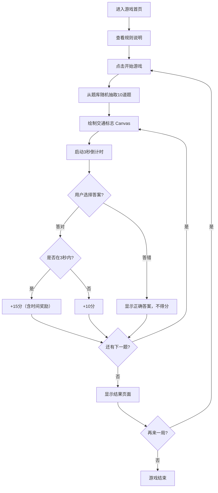

## 1. 产品概述

交通标志识别游戏是一款教育类网页游戏，通过游戏化的方式帮助用户学习和识别常见的交通标志。用户在限定时间内从4个选项中选出当前显示标志的正确含义，答对获得分数，快速作答可获得时间奖励。

- 主要目的：通过趣味性游戏方式普及交通标志知识，提升交通安全意识
- 目标用户：学车学员、交通安全教育受众、普通大众
- 产品价值：寓教于乐，低门槛学习交通标志，随时随地可练习

## 2. 核心功能

### 2.1 用户角色
| 角色 | 注册方式 | 核心权限 |
|------|----------|----------|
| 玩家 | 无需注册，直接进入 | 进行游戏、查看得分 |

### 2.2 功能模块
1. **游戏主页面**：开始游戏按钮、游戏规则说明、游戏流程展示
2. **答题页面**：交通标志Canvas绘制区、倒计时进度条、4个选项按钮、分数显示、题数进度
3. **结果页面**：总得分、答题正确率、各题答题详情、重新开始按钮

### 2.3 页面详情
| 页面名称 | 模块名称 | 功能描述 |
|-----------|-------------|---------------------|
| 游戏主页面 | 欢迎区 | 显示游戏标题、交通标志主题装饰、开始游戏按钮 |
| 游戏主页面 | 规则说明区 | 展示游戏规则：共10题、每题10分、3秒内答题额外+5分、答错显示正确答案 |
| 答题页面 | 标志展示区 | 使用Canvas动态绘制交通标志图案，含动画入场效果 |
| 答题页面 | 计时进度条 | 3秒倒计时进度条，显示剩余时间，时间用尽后奖励消失 |
| 答题页面 | 选项区 | 4个含义选项按钮，悬停效果，点击后即时反馈（正确/错误） |
| 答题页面 | 信息栏 | 当前题数/总题数、当前得分、时间奖励状态提示 |
| 答题页面 | 反馈层 | 答对显示"正确 +10/15分"，答错高亮正确选项并显示正确答案 |
| 结果页面 | 成绩总览 | 显示总分、答对题数、正确率、时间奖励获得次数 |
| 结果页面 | 答题详情 | 10道题的回顾列表，显示每题对错、得分情况 |
| 结果页面 | 操作按钮 | 再来一局按钮，支持重新开始游戏 |

## 3. 核心流程

用户进入游戏首页 → 查看规则并点击"开始游戏" → 系统从题库随机抽取10题 → 逐题显示：

1. Canvas绘制交通标志 → 3秒倒计时开始 → 用户选择答案 → 即时反馈 → 进入下一题
2. 答对：+10分基础分，若在3秒内答对额外+5分
3. 答错：显示正确答案，不得分
4. 10题完成后 → 显示结果页面 → 用户可选择重新开始

## 4. 用户界面设计

### 4.1 设计风格
- **主色调**：交通标志标准配色 — 红色(#E30613)、黄色(#FFD700)、蓝色(#0055A4)、绿色(#00A651)
- **辅助色**：深灰(#1F2937)背景，白色(#FFFFFF)文字，浅灰(#F3F4F6)卡片底
- **按钮风格**：圆角矩形(12px)、带微妙阴影、hover时上浮2px，正确时绿色闪烁，错误时红色抖动
- **字体**：标题使用"ZCOOL KuaiLe"或类似活泼中文手写字体，正文使用"Noto Sans SC"无衬线体
- **布局风格**：卡片式布局，居中对齐，答题卡片带边框和阴影，视觉层次分明
- **图标/emoji风格**：使用交通标志主题emoji（🚦🚧🚸🚙），Canvas绘制的标志采用简化但易于识别的风格

### 4.2 页面设计概述
| 页面名称 | 模块名称 | UI元素 |
|-----------|-------------|-------------|
| 游戏主页面 | 欢迎区 | 渐变背景、大标题带发光效果、装饰性交通标志环绕、悬浮按钮动效 |
| 游戏主页面 | 规则说明区 | 卡片样式、编号列表、关键数据高亮（10分、5分、3秒等用彩色标注） |
| 答题页面 | 标志展示区 | 大尺寸Canvas(300x300)、白色圆角背景、标志入场缩放动画、边框发光效果 |
| 答题页面 | 计时进度条 | 顶部进度条，绿色→黄色→红色渐变，剩余时间数字显示 |
| 答题页面 | 选项区 | 2x2网格布局，每个选项带阴影和边框，选中态明显 |
| 答题页面 | 信息栏 | 顶部状态栏，题数进度、得分、时间奖励徽章 |
| 结果页面 | 成绩总览 | 大号分数显示、环形进度条显示正确率、数据统计卡片 |
| 结果页面 | 答题详情 | 可滚动列表，每题小图+对错标识+得分 |

### 4.3 响应性
- **桌面优先**：主容器最大宽度900px，居中显示
- **平板适配**：在768px以下，选项从2x2调整为1x4纵向排列，Canvas尺寸调整为250x250
- **手机适配**：在480px以下，字体缩小15%，内边距减小，按钮点击区域不小于44x44px
- **触摸优化**：所有可点击元素增加触摸反馈（:active态缩放0.95）

### 4.4 Canvas绘制规范
- 采用256x256坐标系绘制，等比缩放到实际Canvas尺寸
- 标志类型包括：
  - 禁令标志：红色圆形、红色方形带斜杠
  - 警告标志：黄色等边三角形带黑色边框和图案
  - 指示标志：蓝色圆形或方形，白色图案
  - 指路标志：蓝/绿色方形或矩形，白色文字和图案
- 使用简单几何图形和文字绘制，不依赖外部图片资源
- 绘制前清空画布，确保标志清晰、比例正确、颜色符合国家标准
