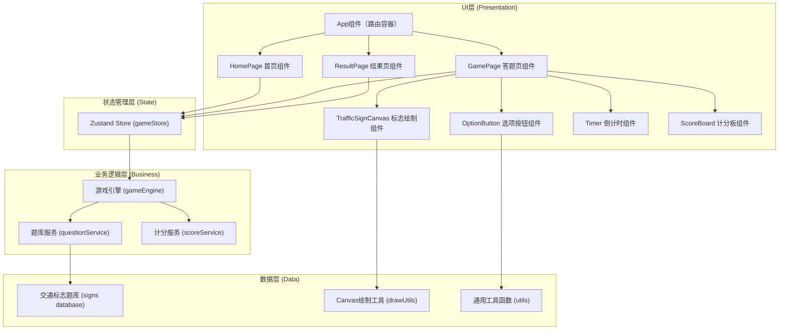

## 1. 架构设计

本项目为纯前端单页应用，无需后端服务，所有数据存储在前端内存中。采用分层架构设计，确保代码职责清晰、易于维护。



## 2. 技术描述

- **前端**：React@18 + TypeScript + Vite@5 + TailwindCSS@3 + Zustand@4 + React Router DOM@6
- **初始化工具**：vite-init（react-ts模板）
- **后端**：无（纯前端应用）
- **数据库**：无，数据使用TypeScript常量定义在前端代码中
- **Canvas绘图**：原生HTML5 Canvas 2D API，自定义绘制工具函数
- **图标库**：lucide-react（用于UI装饰图标）

## 3. 路由定义

| 路由 | 页面组件 | 用途 |
|-------|---------|------|
| `/` | HomePage | 游戏首页，展示规则和开始按钮 |
| `/game` | GamePage | 答题主页面，显示标志和选项 |
| `/result` | ResultPage | 结果页面，展示得分和详情 |

## 4. 数据模型

### 4.1 交通标志数据模型

```typescript
// 交通标志类型
enum SignCategory {
  PROHIBITION = 'prohibition',   // 禁令标志
  WARNING = 'warning',           // 警告标志
  INDICATION = 'indication',     // 指示标志
  GUIDE = 'guide'                // 指路标志
}

// 交通标志定义
interface TrafficSign {
  id: string;                    // 唯一标识
  name: string;                  // 标志含义（正确答案）
  category: SignCategory;        // 标志分类
  drawKey: string;               // 绘制函数标识
  description?: string;          // 详细说明
}

// 题目选项
interface QuestionOption {
  id: string;
  text: string;
  isCorrect: boolean;
}

// 题目
interface Question {
  id: string;
  sign: TrafficSign;
  options: QuestionOption[];     // 4个选项
  correctOptionId: string;
}

// 用户答题记录
interface AnswerRecord {
  questionId: string;
  signId: string;
  signName: string;
  selectedOptionId: string | null;
  isCorrect: boolean;
  timeTaken: number;             // 作答用时（毫秒）
  earnedScore: number;           // 获得分数
  earnedBonus: boolean;          // 是否获得时间奖励
}

// 游戏状态
enum GameStatus {
  IDLE = 'idle',
  PLAYING = 'playing',
  ANSWERED = 'answered',
  FINISHED = 'finished'
}

// 游戏状态Store
interface GameState {
  status: GameStatus;
  currentQuestionIndex: number;  // 当前题号（0-9）
  questions: Question[];         // 本次游戏10道题
  answers: AnswerRecord[];       // 答题记录
  totalScore: number;            // 总分
  questionStartTime: number;     // 当前题目开始时间戳
  timeBonusWindow: number;       // 时间奖励窗口（毫秒）
}
```

## 5. 目录结构

```
solo6-34/
├── src/
│   ├── components/
│   │   ├── TrafficSignCanvas.tsx    # Canvas绘制交通标志组件
│   │   ├── OptionButton.tsx         # 选项按钮组件
│   │   ├── Timer.tsx                # 倒计时进度条组件
│   │   ├── ScoreBoard.tsx           # 计分板组件
│   │   ├── ProgressIndicator.tsx    # 题数进度指示器
│   │   └── FeedbackOverlay.tsx      # 答题反馈浮层
│   ├── pages/
│   │   ├── HomePage.tsx             # 游戏首页
│   │   ├── GamePage.tsx             # 答题主页面
│   │   └── ResultPage.tsx           # 结果页面
│   ├── hooks/
│   │   └── useCountdown.ts          # 倒计时自定义Hook
│   ├── store/
│   │   └── gameStore.ts             # Zustand状态管理
│   ├── services/
│   │   ├── questionService.ts       # 题目生成服务
│   │   ├── scoreService.ts          # 计分服务
│   │   └── gameEngine.ts            # 游戏引擎（流程控制）
│   ├── data/
│   │   └── signs.ts                 # 30个交通标志题库数据
│   ├── utils/
│   │   ├── drawUtils.ts             # Canvas绘制工具函数
│   │   └── shuffle.ts               // 洗牌/随机工具函数
│   ├── types/
│   │   └── index.ts                 # 全局类型定义
│   ├── App.tsx                      # 应用根组件（路由）
│   ├── main.tsx                     # 入口文件
│   └── index.css                    # 全局样式（Tailwind）
├── .trae/documents/                 # 文档目录
├── package.json
├── tsconfig.json
├── vite.config.ts
├── tailwind.config.js
└── postcss.config.js
```

## 6. 核心模块设计

### 6.1 交通标志绘制模块 (drawUtils + TrafficSignCanvas)
- 职责：根据TrafficSign的drawKey调用对应的绘制函数
- 按标志分类（禁令/警告/指示/指路）组织绘制函数
- 每个绘制函数接收CanvasRenderingContext2D和尺寸参数
- 采用256x256虚拟坐标系，使用transform等比缩放适配实际Canvas

### 6.2 题目生成模块 (questionService)
- 职责：从30个题库中随机抽取10题，为每题生成4个选项（1对3错）
- 错误选项从同类别其他标志中随机选取，增加难度
- 选项顺序随机打乱，避免正确答案位置规律

### 6.3 计分模块 (scoreService)
- 职责：计算单题得分和累计总分
- 基础分：答对+10分，答错+0分
- 时间奖励：作答用时<3秒额外+5分
- 记录每题的得分明细和是否获得奖励

### 6.4 状态管理 (gameStore)
- 职责：管理游戏全生命周期状态
- 提供actions：startGame、submitAnswer、nextQuestion、resetGame
- 提供derived状态：currentQuestion、remainingQuestions、correctCount、accuracyRate
